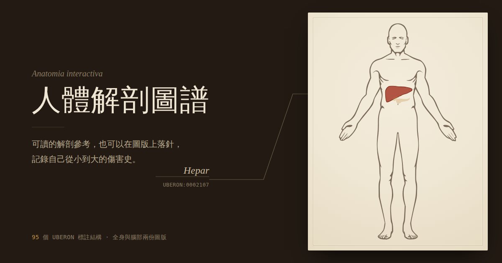

# 我的身體解剖圖譜 · History of My Buddy

一份可以互動的人體解剖圖譜，也是一本記錄自己身體傷害史的簿子。

**線上版本 → https://ai-sub3.github.io/listen-to-your-buddy/**



---

## 這是什麼

95 個依 [UBERON](https://obophenotype.github.io/uberon/) 本體論標註的解剖結構，分屬全身與腦部兩份圖版。每個結構附概述、構造、功能、量化數據與臨床要點五個分頁。

除了當參考書讀，它還有第二個用途：在圖版上落針，把自己從小到大受過的傷一筆一筆記下來。

整個網站是**單一個 HTML 檔案**，沒有後端、沒有資料庫、沒有帳號系統，也沒有任何追蹤。

## 兩個模式

### 圖譜

點圖上的結構，或用左欄索引搜尋中文、英文、拉丁名與 UBERON 編號。選取後會從結構重心拉出一條引線到圖版邊緣，附上拉丁學名與本體論編號——銅版解剖圖的標號慣例。

內臟本來就層層相疊，所以在同一點連續點擊會往下一層走，滑鼠提示會顯示目前在第幾層。

### 傷害誌

在圖版上點一下就標出一個部位。座標存的是圖版自身的 SVG 座標，不受本體論覆蓋範圍限制——踝、膝、肩這些圖上沒有標註的地方一樣標得了。若落點剛好在已標註的結構上，會自動帶入名稱與 UBERON 編號。

資料分兩層：**部位 → 傷害紀錄[]**。同一個右外踝扭三次是一個部位掛三筆紀錄，復發次數會自己浮出來。每筆記錄日期、類型、程度、成因、當時活動、休養天數、診斷與影像、治療與復健、備註與目前狀態。

日期接受 `2015`、`2015-08`、`2015-08-14` 三種精度——童年的事情很多只記得年份，逼人填完整日期只會讓人亂填。

圖版下方是一條生命時間軸，年份在下、年齡在上（設定出生年後出現）。

## 鍵盤操作

| 按鍵 | 動作 |
| --- | --- |
| `/` | 跳至搜尋 |
| `↑` `↓` | 在索引中移動 |
| `1`–`5` | 切換資訊分頁 |
| `Esc` | 取消選取 |
| 滾輪 · 拖曳 | 縮放與平移圖版 |

## 你的紀錄存在哪

**只存在你自己的裝置上。** 資料寫入瀏覽器的 localStorage，從來沒有離開過你的電腦或手機——沒有伺服器在收，也沒有地方可以收。

這代表：

- 每個打開這個連結的人，看到的都是自己的紀錄。彼此看不到，連分享連結的人也看不到。
- 換一台裝置就是另一份空白的紀錄，不會同步。
- 清除瀏覽器資料會一併清掉它。

所以請**定期匯出備份**。左下角有匯出 JSON 的按鈕，有紀錄但從未備份時燈號會轉黃提醒。匯入時可以選擇合併或取代。

匯出的格式是可讀的 JSON：

```json
{
  "birthYear": 1990,
  "sites": [
    { "id": "a1b2c3", "view": "body", "x": 52.0, "y": 178.4,
      "label": "外踝", "side": "右", "uberon": null }
  ],
  "injuries": [
    { "id": "d4e5f6", "siteId": "a1b2c3", "date": "2026-08-09",
      "type": "韌帶扭傷", "severity": 2, "cause": "訓練",
      "status": "反覆發作", "activity": "越野跑下坡", "downtime": "21",
      "dx": "超音波：前距腓韌帶第一度撕裂", "tx": "冰敷加壓、腓骨肌與平衡訓練",
      "notes": "" }
  ]
}
```

## 檔案

| 檔案 | 用途 |
| --- | --- |
| `index.html` | 整個網站，單一檔案自足 |
| `og-cover.png` | 分享到社群時的預覽圖（1200×630） |

要自己架一份的話，把這兩個檔案放進任何靜態空間即可。如果換了網址，記得改 `index.html` 開頭的 `og:url`、`og:image`、`twitter:image` 與 `canonical` 四個絕對網址。

## 來源與授權

底圖與 UBERON 標註取自 EBI 的 [anatomogram](https://www.npmjs.com/package/@ebi-gene-expression-group/anatomogram)，原始插圖來自 [Wikimedia Commons](https://commons.wikimedia.org/wiki/File:Human_body_features.svg)，公眾領域（CC0）。

本體論編號採 [UBERON](https://obophenotype.github.io/uberon/)，跨物種解剖本體論，以 CC BY 3.0 釋出。

## 免責聲明

此頁供學習與個人紀錄使用，**不構成醫療建議，也不能取代專業診斷**。

「診斷與影像」欄位是用來抄寫你已經從醫療人員那裡取得的診斷，不是用來自我判斷的。文中的數值都是健康成人的典型範圍，個體差異很大，只能給個比例感。身體有狀況請找醫師。

---

由 Aaron 製作。
